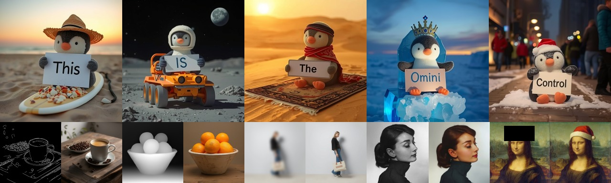
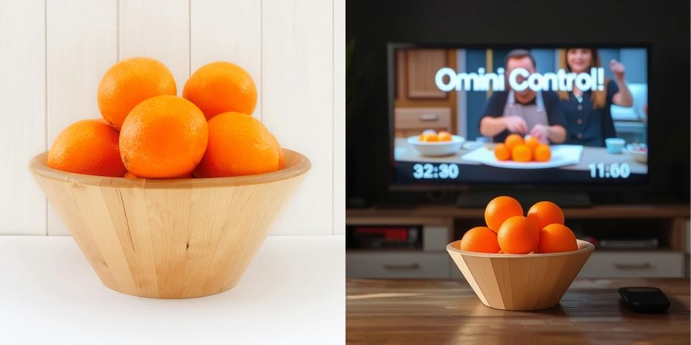
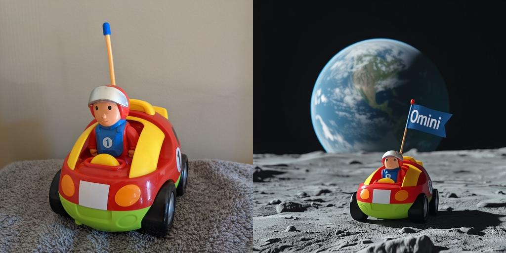
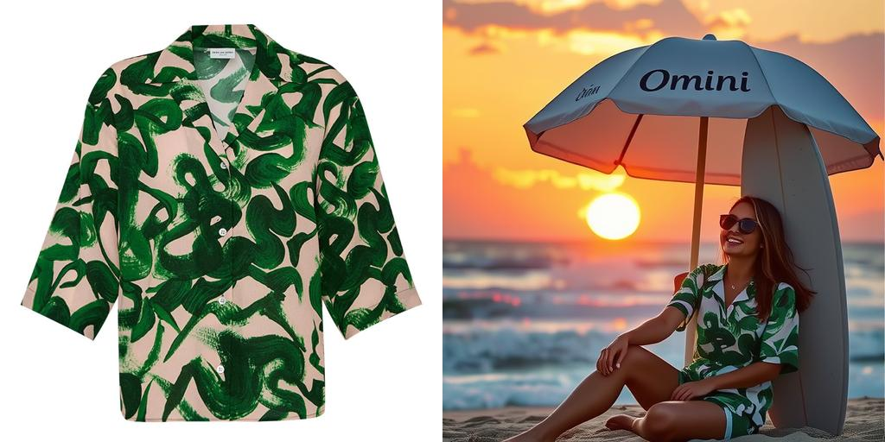
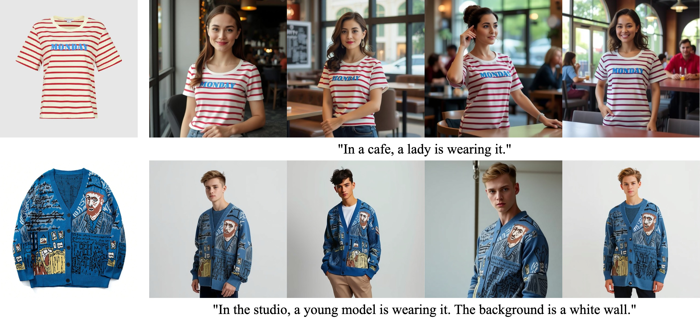
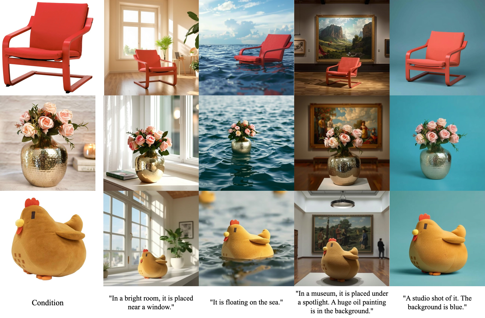
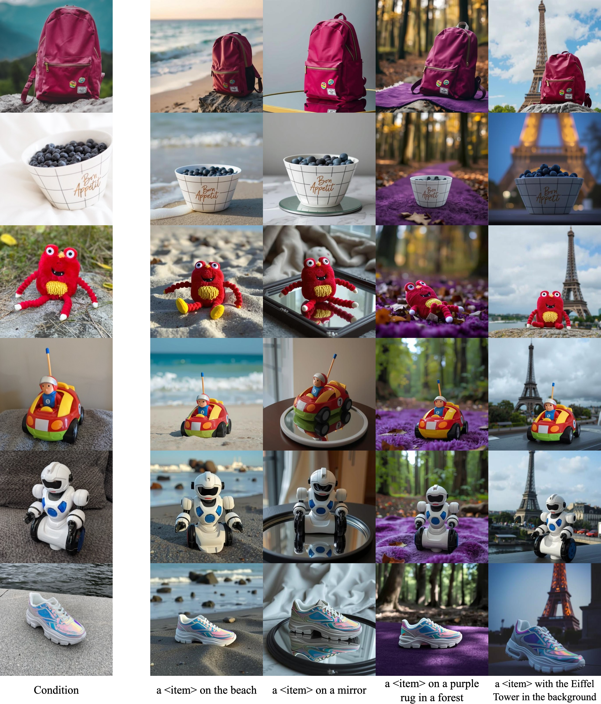
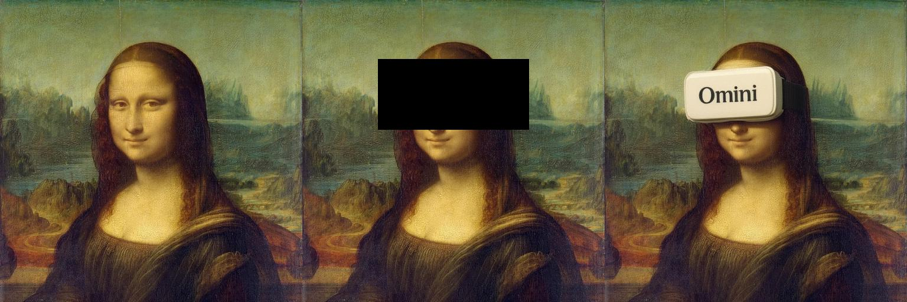

# OminiControl



<br>

<a href="https://huggingface.co/Yuanshi/OminiControl"></a>
<a href="https://huggingface.co/spaces/Yuanshi/OminiControl"></a>
<a href="https://huggingface.co/spaces/Yuanshi/OminiControl_Art"></a>
<a href="https://github.com/Yuanshi9815/Subjects200K"></a>
<a href="https://huggingface.co/datasets/Yuanshi/Subjects200K"></a>
<br>
<a href="https://arxiv.org/abs/2411.15098"></a>
<a href="https://arxiv.org/abs/2503.08280"></a>

> **OminiControl: Minimal and Universal Control for Diffusion Transformer**
> <br>
> Zhenxiong Tan, 
> [Songhua Liu](http://121.37.94.87/), 
> [Xingyi Yang](https://adamdad.github.io/), 
> Qiaochu Xue, 
> and 
> [Xinchao Wang](https://sites.google.com/site/sitexinchaowang/)
> <br>
> [xML Lab](https://sites.google.com/view/xml-nus), National University of Singapore
> <br>

> **OminiControl2: Efficient Conditioning for Diffusion Transformers**
> <br>
> Zhenxiong Tan, 
> Qiaochu Xue, 
> [Xingyi Yang](https://adamdad.github.io/), 
> [Songhua Liu](http://121.37.94.87/), 
> and 
> [Xinchao Wang](https://sites.google.com/site/sitexinchaowang/)
> <br>
> [xML Lab](https://sites.google.com/view/xml-nus), National University of Singapore
> <br>


## Features

OminiControl is a minimal yet powerful universal control framework for Diffusion Transformer models like [FLUX](https://github.com/black-forest-labs/flux).

* **Universal Control 🌐**:  A unified control framework that supports both subject-driven control and spatial control (such as edge-guided and in-painting generation).

* **Minimal Design 🚀**: Injects control signals while preserving original model structure. Only introduces 0.1% additional parameters to the base model.

## News
- **2025-05-12**: ⭐️ The code of [OminiControl2](https://arxiv.org/abs/2503.08280) is released. It introduces a new efficient conditioning method for diffusion transformers. (Check out the training code [here](./train)).
- **2025-05-12**: Support custom style LoRA. (Check out the [example](./examples/combine_with_style_lora.ipynb)).
- **2025-04-09**: ⭐️ [OminiControl Art](https://huggingface.co/spaces/Yuanshi/OminiControl_Art) is released. It can stylize any image with a artistic style. (Check out the [demo](https://huggingface.co/spaces/Yuanshi/OminiControl_Art) and [inference examples](./examples/ominicontrol_art.ipynb)).
- **2024-12-26**: Training code are released. Now you can create your own OminiControl model by customizing any control tasks (3D, multi-view, pose-guided, try-on, etc.) with the FLUX model. Check the [training folder](./train) for more details.

## Quick Start
### Setup (Optional)
1. **Environment setup**
```bash
conda create -n omini python=3.12
conda activate omini
```
2. **Requirements installation**
```bash
pip install -r requirements.txt
```
### Usage example
1. Subject-driven generation: `examples/subject.ipynb`
2. In-painting: `examples/inpainting.ipynb`
3. Canny edge to image, depth to image, colorization, deblurring: `examples/spatial.ipynb`


### Guidelines for subject-driven generation
1. Input images are automatically center-cropped and resized to 512x512 resolution.
2. When writing prompts, refer to the subject using phrases like `this item`, `the object`, or `it`. e.g.
   1. *A close up view of this item. It is placed on a wooden table.*
   2. *A young lady is wearing this shirt.*
3. The model primarily works with objects rather than human subjects currently, due to the absence of human data in training.

## Generated samples
### Subject-driven generation
<a href="https://huggingface.co/spaces/Yuanshi/OminiControl"></a>

**Demos** (Left: condition image; Right: generated image)

<div float="left">
  
  
  
  
</div>

<details>
<summary>Text Prompts</summary>

- Prompt1: *A close up view of this item. It is placed on a wooden table. The background is a dark room, the TV is on, and the screen is showing a cooking show. With text on the screen that reads 'Omini Control!.'*
- Prompt2: *A film style shot. On the moon, this item drives across the moon surface. A flag on it reads 'Omini'. The background is that Earth looms large in the foreground.*
- Prompt3: *In a Bauhaus style room, this item is placed on a shiny glass table, with a vase of flowers next to it. In the afternoon sun, the shadows of the blinds are cast on the wall.*
- Prompt4: *"On the beach, a lady sits under a beach umbrella with 'Omini' written on it. She's wearing this shirt and has a big smile on her face, with her surfboard hehind her. The sun is setting in the background. The sky is a beautiful shade of orange and purple."*
</details>
<details>
<summary>More results</summary>

* Try on:
  
* Scene variations:
  
* Dreambooth dataset:
  
* Oye-cartoon finetune:
  <div float="left">
    
    
  </div>
</details>

### Spatially aligned control
1. **Image Inpainting** (Left: original image; Center: masked image; Right: filled image)
  - Prompt: *The Mona Lisa is wearing a white VR headset with 'Omini' written on it.*
    </br>
    
  - Prompt: *A yellow book with the word 'OMINI' in large font on the cover. The text 'for FLUX' appears at the bottom.*
    </br>
    
2. **Other spatially aligned tasks**  (Canny edge to image, depth to image, colorization, deblurring) 
    </br>
    <details>
    <summary>Click to show</summary>
    <div float="left">
      
      
      
      
    </div>
    
    Prompt: *A light gray sofa stands against a white wall, featuring a black and white geometric patterned pillow. A white side table sits next to the sofa, topped with a white adjustable desk lamp and some books. Dark hardwood flooring contrasts with the pale walls and furniture.*
    </details>
   
### Stylize images
<a href="https://huggingface.co/spaces/Yuanshi/OminiControl_Art"></a>
</br>


</br>


## Models

**Subject-driven control:**
| Model                                                                                            | Base model     | Description                                                                                                                                                 | Resolution   |
| ------------------------------------------------------------------------------------------------ | -------------- | ----------------------------------------------------------------------------------------------------------------------------------------------------------- | ------------ |
| [`experimental`](https://huggingface.co/Yuanshi/OminiControl/tree/main/experimental) / `subject` | FLUX.1-schnell | The model used in the paper.                                                                                                                                | (512, 512)   |
| [`omini`](https://huggingface.co/Yuanshi/OminiControl/tree/main/omini) / `subject_512`           | FLUX.1-schnell | The model has been fine-tuned on a larger dataset.                                                                                                          | (512, 512)   |
| [`omini`](https://huggingface.co/Yuanshi/OminiControl/tree/main/omini) / `subject_1024`          | FLUX.1-schnell | The model has been fine-tuned on a larger dataset and accommodates higher resolution.                                                                       | (1024, 1024) |
| [`oye-cartoon`](https://huggingface.co/saquiboye/oye-cartoon)                                    | FLUX.1-dev     | The model has been fine-tuned on [oye-cartoon](https://huggingface.co/datasets/saquiboye/oye-cartoon) dataset by [@saquib764](https://github.com/Saquib764) | (512, 512)   |

**Spatial aligned control:**
| Model                                                                                                     | Base model | Description                                                                | Resolution   |
| --------------------------------------------------------------------------------------------------------- | ---------- | -------------------------------------------------------------------------- | ------------ |
| [`experimental`](https://huggingface.co/Yuanshi/OminiControl/tree/main/experimental) / `<task_name>`      | FLUX.1     | Canny edge to image, depth to image, colorization, deblurring, in-painting | (512, 512)   |=

## Community Extensions
- [ComfyUI-Diffusers-OminiControl](https://github.com/Macoron/ComfyUI-Diffusers-OminiControl) - ComfyUI integration by [@Macoron](https://github.com/Macoron)
- [ComfyUI_RH_OminiControl](https://github.com/HM-RunningHub/ComfyUI_RH_OminiControl) - ComfyUI integration by [@HM-RunningHub](https://github.com/HM-RunningHub)

## Limitations
1. The model's subject-driven generation primarily works with objects rather than human subjects due to the absence of human data in training.
2. The subject-driven generation model may not work well with `FLUX.1-dev`.
3. The released model only supports the resolution of 512x512.

## Training
Training instructions can be found in this [folder](./train).


## To-do
- [x] Release the training code.
- [x] Release the model for higher resolution (1024x1024).

## Acknowledgment
We would like to acknowledge that the computational work involved in this research work is partially supported by NUS IT’s Research Computing group using grant numbers NUSREC-HPC-00001.

## Citation
```
@article{tan2025ominicontrol,
  title={OminiControl: Minimal and Universal Control for Diffusion Transformer},
  author={Tan, Zhenxiong and Liu, Songhua and Yang, Xingyi and Xue, Qiaochu and Wang, Xinchao},
  booktitle={Proceedings of the IEEE/CVF International Conference on Computer Vision},
  year={2025}
}

@article{tan2025ominicontrol2,
  title={OminiControl2: Efficient Conditioning for Diffusion Transformers},
  author={Tan, Zhenxiong and Xue, Qiaochu and Yang, Xingyi and Liu, Songhua and Wang, Xinchao},
  journal={arXiv preprint arXiv:2503.08280},
  year={2025}
}
```
