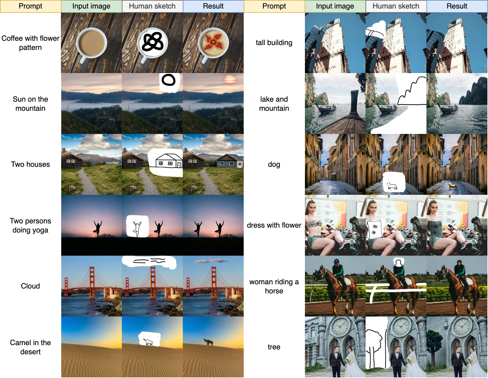
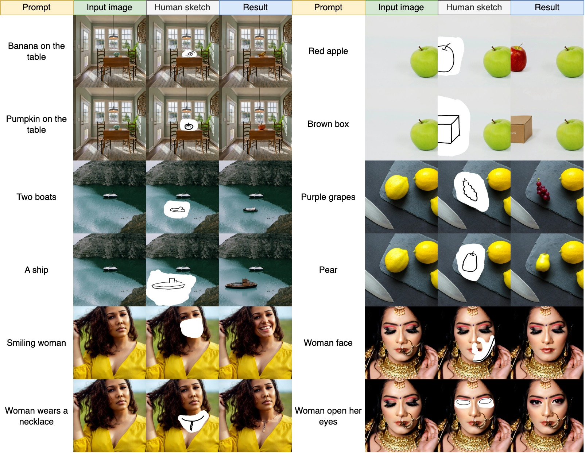
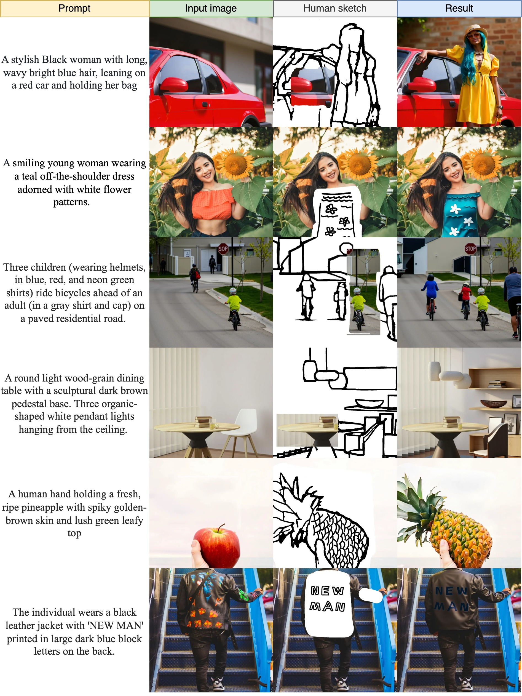
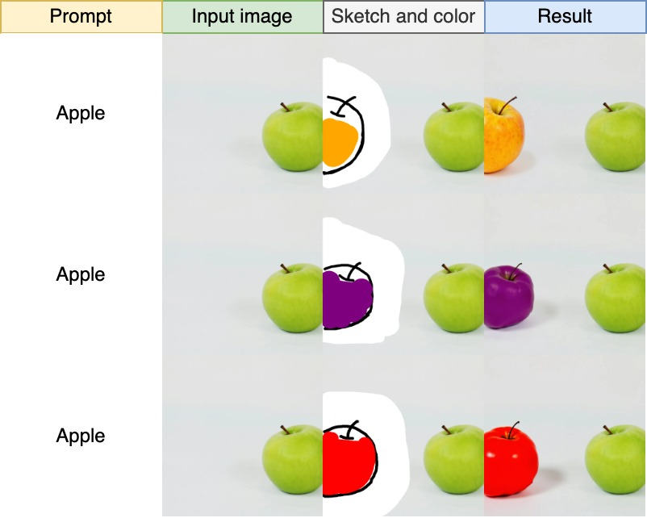
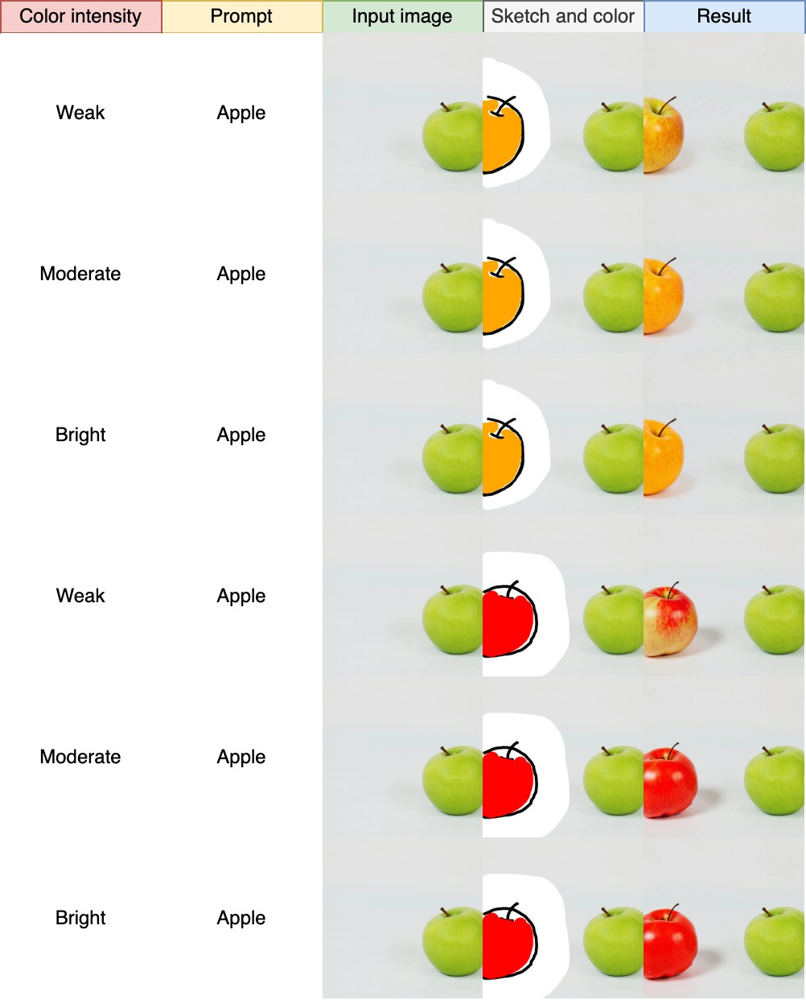

# MagicOmini

<div align="center">
  
  
</div>
<br>


> **MagicOmini: Efficient Local Sketch Editing for Diffusion Transformers**
> <br>
> Qiqi Wang, 
University of Chinese Academy of Sciences
> <br>


## Features

MagicOmini is a minimal yet powerful local sketch-editing framework for Diffusion Transformer models like [FLUX](https://github.com/black-forest-labs/flux), built upon [OminiControl](https://github.com/Yuanshi9815/OminiControl).

## Quick Start
### Setup (Optional)
1. **Environment setup**
```bash
conda create -n magicomini python=3.11
conda activate magicomini
```
2. **Requirements installation**
```bash
pip install torch==2.4.1 torchvision==0.19.1 torchaudio==2.4.1 --index-url https://download.pytorch.org/whl/cu124
pip install -r requirements.txt
```

3. **Checkpoints**
Coming soon


## Visual Result
### Simple UI sketch example





### Complicated UI sketch example 



### UI sketch example with hint of color

#### Different color



#### Same color of different intensity




### Notation
1. Input images are automatically resized to 512x512 or 1024x1024 resolution.


## Acknowledgment

We would like to thank the [OminiControl](https://github.com/Yuanshi9815/OminiControl) team for their excellent work, which serves as the foundation for this project.


## Citation

If you find this work useful, please consider citing:

```bibtex
@article{ominicontrol,
  title={OminiControl: Minimal and Universal Control for Diffusion Transformer},
  author={Xiang, Zhenxiong and Hu, Xinzhe and Zheng, Haoji and Dang, Yingqing and Li, Ying and Shi, Min and Liu, Haoming and Qiao, Yu and Shan, Ying},
  journal={arXiv preprint arXiv:2411.15098},
  year={2024}
}
```
